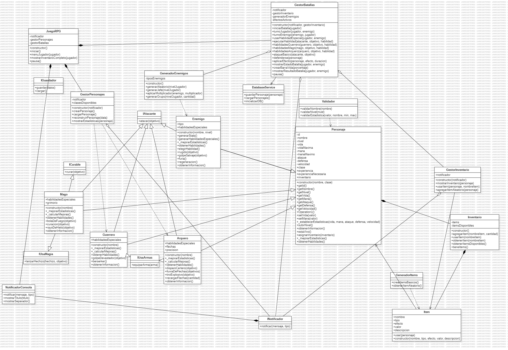

#  Simulador de Batallas RPG por Consola

Un juego de rol (RPG) por consola desarrollado en **Node.js**, donde puedes crear un personaje, enfrentarte a enemigos controlados por IA y guardar tu progreso localmente.

---

## Características

- Crear personajes personalizados de clases: `Mago`, `Guerrero` o `Arquero`.
- Guardar y cargar personajes desde una base de datos local (`lowdb`).
- Sistema de batallas por turnos contra enemigos con IA.
- Mostrar estadísticas y progreso del jugador.
- Guardado automático después de cada batalla.

---

## Tecnologías usadas

- Node.js
- Inquirer (menús interactivos en consola)
- lowdb (base de datos JSON local)
- CommonJS Modules
- uuid (IDs únicos)

---

## Instalación

1. Clona el repositorio:
```bash
git clone https://github.com/tu_usuario/simulador-rpg-consola.git
```

Instala las dependencias:

```bash
npm install
```
### Cómo jugar

Ejecuta el juego con:

```bash
node index.js
```
Sigue las instrucciones para:

- Crear un nuevo personaje o cargar uno existente.

- Elegir tu clase.

- Batallar contra enemigos.

- Consultar estadísticas o guardar el progreso.

## Estructura del proyecto
``` pgsql
├── index.js
├── README.md
├── package.json
├── data/
│   └── personajes.json
│
├── src/
│   ├── interfaces/
│   │   └── interfaces.js
│   ├── models/
│   │   ├── personaje.js
│   │   ├── mago.js
│   │   ├── guerrero.js
│   │   ├── enemigo.js
│   │   ├── item.js
│   │   ├── inventario.js
│   │   └── arquero.js
│   │
│   ├── services/
│   │   ├── db.js
│   │   ├── generadorEnemigos.js
│   │   ├── gestorInventario.js
│   │   ├── gestorPersonajes.js
│   │   ├── notificador.js
│   │   ├── validador.js
│   │   └── gestorBatallas.js


```

## Diagrama de clases UML


## video de sustentacion

https://www.canva.com/design/DAGt3HvW4AI/r71y3uvzu96qUeVZq3VzNw/edit?utm_content=DAGt3HvW4AI&utm_campaign=designshare&utm_medium=link2&utm_source=sharebutton

## Autores
 - Johan Andrey Guarin
 - Jose Julian Ortega
 - Hely Santiago Diaz